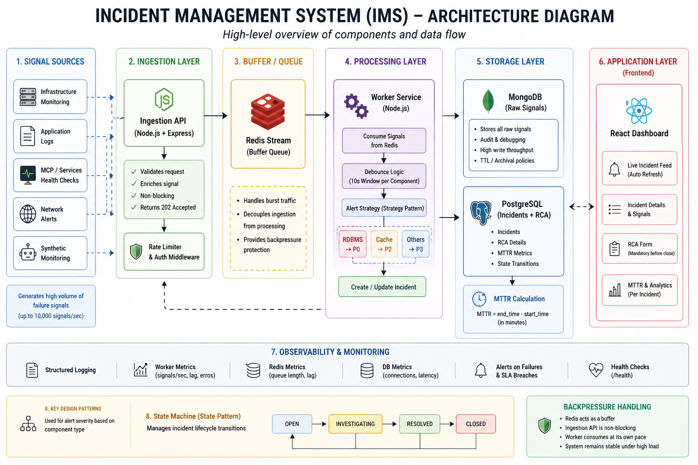

# 🚨 Incident Management System (IMS)

A resilient, distributed **Incident Management System** designed to ingest high-volume signals, intelligently group them into incidents, and drive a structured resolution workflow with mandatory RCA and MTTR tracking.

---

## 🧠 Overview

In real-world distributed systems, failures generate massive volumes of signals (errors, latency spikes, alerts).
This system:

* **Ingests signals at high throughput**
* **Debounces duplicate failures**
* **Creates structured incidents**
* **Enforces RCA before closure**
* **Calculates MTTR automatically**
* **Provides a live dashboard UI**

---

## 🏗️ Architecture

```
                ┌────────────────────┐
                │   Signal Producer  │
                │  (API / cURL)      │
                └────────┬───────────┘
                         │
                         ▼
                ┌────────────────────┐
                │   Ingestion API    │
                │ (Express + RateLimit)
                └────────┬───────────┘
                         │
                         ▼
                ┌────────────────────┐
                │     Redis Stream   │  ← Buffer + Queue
                └────────┬───────────┘
                         │
                         ▼
                ┌────────────────────┐
                │   Worker Engine    │
                │ (Async Processor)  │
                └────────┬───────────┘
                         │
        ┌────────────────┼────────────────┐
        ▼                                 ▼
┌───────────────┐               ┌─────────────────┐
│   MongoDB     │               │   PostgreSQL    │
│ Raw Signals   │               │ Incidents + RCA │
└───────────────┘               └─────────────────┘
                                         │
                                         ▼
                                ┌────────────────┐
                                │   React UI     │
                                │ Live Dashboard │
                                └────────────────┘
```

---

## ⚙️ Tech Stack

| Layer            | Technology        |
| ---------------- | ----------------- |
| Backend          | Node.js, Express  |
| Queue            | Redis Streams     |
| Worker           | Async Node Worker |
| Structured DB    | PostgreSQL        |
| Raw Logs Store   | MongoDB           |
| Frontend         | React             |
| Containerization | Docker Compose    |

---

## 🚀 Features

### ✅ Backend Engine

* ⚡ **Async Processing** using Redis Streams + Worker
* 🧠 **Debouncing Logic**

  * Multiple signals → single incident
* 🔒 **Mandatory RCA Enforcement**

  * Cannot close incident without RCA
* ⏱️ **MTTR Calculation**

  * Based on start_time and end_time
* 🚦 **State Machine**

  ```
  OPEN → INVESTIGATING → RESOLVED → CLOSED
  ```

---

### 📊 Dashboard (Frontend)

* 🔴 Live incident feed (auto-refresh)
* 📌 Severity-based sorting (P0 → P3)
* 🔍 Incident detail panel
* 📥 Raw signals view
* 📝 RCA submission form
* ⏱️ MTTR display

---

## 🐳 Setup Instructions

### 1. Clone Repo

```bash
git clone <your-repo-url>
cd ims
```

---

### 2. Start Infrastructure

```bash
docker-compose up -d
```

This starts:

* Redis → `6379`
* MongoDB → `27017`
* PostgreSQL → `5432`

---

### 3. Backend Setup

```bash
cd backend
npm install
npm run dev
```

---

### 4. Frontend Setup

```bash
cd frontend
npm install
npm start
```

---

### 5. Open App

```
http://localhost:3000
```

---

## 🧪 Sample Data (Simulate Failures)

```bash
chmod +x sample-data/simulate-events.sh
./sample-data/simulate-events.sh
```

---

## 🗄️ Database Schema

### PostgreSQL (Incidents)

| Field        | Type      |
| ------------ | --------- |
| id           | SERIAL    |
| component_id | TEXT      |
| status       | TEXT      |
| severity     | TEXT      |
| created_at   | TIMESTAMP |
| start_time   | TIMESTAMP |
| end_time     | TIMESTAMP |
| mttr         | FLOAT     |
| rca          | JSON      |

---

### MongoDB (Signals)

```json
{
  "componentId": "CACHE_CLUSTER_01",
  "severity": "P2",
  "message": "Cache latency spike",
  "timestamp": 17123456789
}
```

---

## 🔄 Workflow

1. Signal arrives → API
2. Stored in Redis Stream
3. Worker consumes signal
4. Debounce logic checks existing incident
5. New incident created OR linked
6. Raw signal stored in MongoDB
7. UI updates automatically
8. RCA submitted → MTTR calculated
9. Incident transitions → CLOSED

---

## ⚡ Backpressure Handling

Handled using **Redis Streams**:

* Signals buffered in memory (Redis)
* Worker processes asynchronously
* Prevents DB overload
* Ensures no data loss during spikes

---

## 🚦 Rate Limiting

* API protected against burst overload
* Prevents cascading failures

---

## 📈 Observability

* `/health` endpoint available
* Logs:

  * Signals/sec
  * Worker processing
  * Errors

---

## 🧠 Design Patterns Used

| Pattern           | Usage                            |
| ----------------- | -------------------------------- |
| Strategy Pattern  | Alerting based on component type |
| State Pattern     | Incident lifecycle transitions   |
| Producer-Consumer | Redis Stream + Worker            |
| Debounce Logic    | Signal grouping                  |

---

## 🐞 Challenges Faced

* Handling high-throughput ingestion
* Sync issues between UI and backend
* Date-time formatting bugs
* Controller export/import crashes
* Ensuring RCA validation before closure

---

## 💡 Improvements (Future Work)

* WebSockets instead of polling
* Role-based access control
* Alert integrations (Slack/Email)
* Graph analytics dashboard
* Distributed worker scaling

---

## 📌 Conclusion

This system demonstrates:

* Real-world distributed system design
* Async processing & backpressure handling
* Multi-database architecture
* Production-grade debugging & fixes
* End-to-end full-stack integration

---

## 👩‍💻 Author

Anjali Yadav

---
